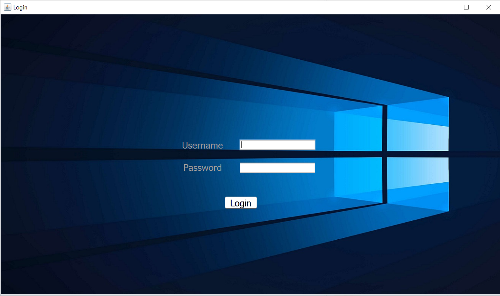

# JavaOS
 A Simulation of real world Operating System\
 Here is what is it looks like 
 
 1.Login -
 
 
 2. Desktop -
 
 
 3. My Computer -
 
 
 Inside these drives , there are folder -
 
 And then the folders open up
 
 4. Notepad
 
 
 5. Terminal
 
 Here is a sample command - ipconfig
 
 
 6. About 
 
 
 7. Browser - It opens up Microsoft edge browser with www.google.com as its default page.
 

 
 
 To use this on your computer run FirstPage.java and enter username - "harsh" and password - "password"

